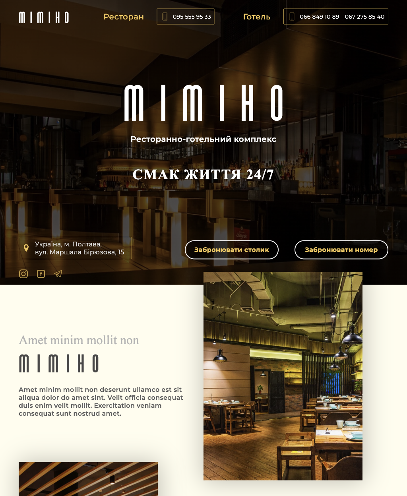

# Міміно

## Опис проекту

Багатосторінковий сайт компанії "Міміно", який допомагає користувачам планувати
та бронювати візит у ресторанно-готельний комплекс, дізнаватися про послуги та
зручності, а також взаємодіяти з адміністрацією через онлайн-форми бронювання.



---

## Виконані технічні завдання

- Проєкт реалізовано з використанням чистого HTML, SASS та JavaScript.
- Виконано адаптивну верстку окрім мобільних пристроїв. Точки перелому:
  - **mobile**: верстка гумова, стає адаптивною на 414px;
  - **tablet**: 1024px;
  - **desktop**: 1280px.
- Забезпечено дотримання семантики відповідно до стандартів HTML5.
- Здійснено підключення шрифтів за допомогою font-face.
- Забезпечено підтримку відображення картинок для retina-екранів.
- Оптимізовано завантаження зображень.
- Додано відображення фавікон сторінки.
- Перевірено верстку на валідність
  ([Validator](https://validator.w3.org/nu/?doc=https%3A%2F%2Fkuhai-anna.github.io%2Fmimino%2Fhotel.html)).

---

## Виконані практичні завдання

#### Main page

##### Header

В Header-і знаходиться лого, навігація та список посилань на соц.мережі (в
мобільній та десктопній версіях).

- Логотип (назву) компанії реалізувано як посилання, яке повертає користувача на
  головну сторінку.
- Навігація реалізована як список елементів, кожен з яких містить в собі
  посилання, що веде на відповідну сторінку, та посилання у вигляді відповідних
  контактних телефонів для зворотнього зв’язку.
- Посилання на соц. мережу відкриває сторонній ресурс в окремій вкладці.

##### Hero

- Містить кнопки, які відкривають модальні вікна для можливості бронювання
  столика в ресторані та номера в готелі.
- Адреса закладу реалізувана як посилання на мапу стороннього ресурсу.
- Планшетна та десктопна версія цієї секції містить посилання зі списку
  соц.мереж.

##### About our restaurant та About our hotel

- У секціях відсутні видимі заголовки, тому додано приховані для краулерів.
- Реалізовано слайдери з контентними зображеннями за допомогою сторонньої
  бібліотеки Slick slider.

##### Details of our restaurant та Details of our hotel

- У секціях реалізовано слайдери з контентними зображеннями за допомогою
  сторонньої бібліотеки Slick slider.
- Секції містять кнопки, які відкривають модальні вікна для можливості
  бронювання столика, номера та перегляду цін на номери в готелі.
- Секція Details of our restaurant мість кнопку “Переглянути меню” реалізована
  як посилання, яке веде користувача на сторінку Restaurant Page.

##### Contacts

- У секції відсутній видимий заголовок, тому додано прихований для краулерів.
- Включає список контактних телефонів закладу для зворотнього зв’язку та його
  адресу з Google мапою.

##### Footer

У Footer-і знаходиться лого, навігація та список посилань на соц.мережі.

- Логотип (назву) компанії реалізувано як посилання, яке повертає користувача на
  головну сторінку.
- Навігація реалізована як список елементів, кожен з яких містить в собі
  посилання, що веде на відповідну сторінку.
- Посилання на соц. мережі відкривають сторонній ресурс в окремій вкладці.

#### Restaurant Page

##### Hero

- Містить кнопка “Забронювати, яка відкриває модальне вікно для можливості
  бронювання столика.
- Кнопка “Переглянути меню” реалізована як якірне посилання, що веде до
  відповідної секції Меню цієї сторінки.
- Адреса закладу реалізувана як посилання на мапу стороннього ресурсу.
- Планшетна та десктопна версія цієї секції містить посилання зі списку
  соц.мереж.

##### About our kitchen

- У секції відсутній видимий заголовок, тому додано прихований для краулерів.
- Реалізовано слайдер з контентними зображеннями за допомогою сторонньої
  бібліотеки Slick slider.

##### Menu

- Зміст меню ресторану реалізувано як таблицю.
- Кнопка “Забронювати столик” відкриває модальне вікно.

#### Hotel Page

##### Hero

- Містить кнопки, які відкривають модальні вікна для можливості бронювання
  номера в готелі та перегляду цін.
- Адреса закладу реалізувана як посилання на мапу стороннього ресурсу.
- Планшетна та десктопна версія цієї секції містить посилання зі списку
  соц.мереж.

##### Секції номерів

- У секціях реалізовано слайдери з контентними зображеннями за допомогою
  сторонньої бібліотеки Slick slider.
- Містить кнопку “Детальніше”, яка реалізована як посилання і веде користувача
  на відповідну сторінку Room Page
- Кнопка “Переглянути ціни” відкриває модальне вікно.

#### Room Page

##### Hero

- У секції реалізовано слайдер з контентними зображеннями за допомогою
  сторонньої бібліотеки Slick slider.
- Містить кнопку “Переглянути ціни”, яка відкриває модальне вікно.

##### Amenities

- Містить кнопку, яка відкриває модальне вікно для можливості бронювання номеру.
- Кнопку “Повернутися до перегляду номерів” реалізовано як посилання, яке веде
  користувача на сторінку Hotel Page.

##### Modal windows

Реалізовано як форми з мінімальною валідацією.

---

### Шаблон Parcel

Цей проєкт створено за допомогою Parcel. Для ознайомлення та налаштування
додаткових можливостей [звернись до документації](https://parceljs.org/).

## Підготовка нового проєкту

1. Переконайся, що на комп’ютері встановлено LTS-версію Node.js.
   [Завантаж і встанови](https://nodejs.org/en/) її, якщо необхідно.
2. Склонуй цей репозиторій.
3. Зміни ім’я папки з `parcel-project-template` на ім’я свого проєкту.
4. Створи новий порожній репозиторій на GitHub.
5. Відкрий проєкт у VSCode, запусти термінал і зв’яжи проєкт з
   GitHub-репозиторієм
   [за інструкцією](https://docs.github.com/en/get-started/getting-started-with-git/managing-remote-repositories#changing-a-remote-repositorys-url).
6. Встанови залежності проєкту в терміналі командою `npm install`.
7. Запусти режим розробки, виконавши команду `npm start`.
8. Перейди в браузері за адресою [http://localhost:1234](http://localhost:1234).
   Ця сторінка буде автоматично перезавантажуватись після збереження змін у
   файлах проєкту.

## Файли та папки

- Усі паршали стилів мають лежати в папці `src/sass` та імпортуватися у файли
  стилів сторінок. Наприклад, для `index.html` файл стилів називається
  `index.scss`.
- Зображення додавай у папку `src/images`. Збирач оптимізує їх, але тільки при
  деплої продакшн версії проєкту. Усе це відбувається в хмарі, щоб не
  навантажувати твій комп’ютер, оскільки на слабких машинах це може зайняти
  багато часу.

## Деплой

Для налаштування деплою проєкту необхідно виконати кілька додаткових кроків з
налаштування твого репозиторію. Зайди у вкладку `Settings` і в підсекції
`Actions` обери пункт `General`.


Прогорни сторінку до останньої секції, де переконайся, що вибрано опції як на
наступному зображенні, і натисни `Save`. Без цих налаштувань у збірки буде
недостатньо прав для автоматизації процесу деплою.


Продакшн версія проєкту буде автоматично збиратись і деплоїтись на GitHub Pages,
у гілку `gh-pages`, кожного разу, коли оновлюється гілка `main`. Наприклад,
після прямого пушу або прийнятого пул-реквеста. Для цього необхідно у файлі
`package.json` відредагувати поле `homepage` і скрипт `build`, замінивши
`your_username` і `your_repo_name` на свої, і відправити зміни на GitHub.

```json
"homepage": "https://your_username.github.io/your_repo_name/",
"scripts": {
  "build": "parcel build src/*.html --public-url /your_repo_name/"
},
```

Далі необхідно зайти в налаштування GitHub-репозиторію (`Settings` > `Pages`) і
виставити роздачу продакшн версії файлів з папки `/root` гілки `gh-pages`, якщо
це не було зроблено автоматично.


### Статус деплою

Статус деплою останнього коміту відображається іконкою біля його ідентифікатора.

- **Жовтий колір** - виконується збірка і деплой проєкту.
- **Зелений колір** - деплой завершився успішно.
- **Червоний колір** - під час лінтингу, збірки або деплою сталася помилка.

Більш детальну інформацію про статус можна подивитись, натиснувши на іконку, і у
випадаючому вікні перейти за посиланням `Details`.


### Жива сторінка

Через деякий час, зазвичай кілька хвилин, живу сторінку можна буде подивитися за
адресою, вказаною у відредагованій властивості `homepage`. Наприклад, ось
посилання на живу версію для цього репозиторію
[https://goitacademy.github.io/parcel-project-template](https://goitacademy.github.io/parcel-project-template).

Якщо відкривається порожня сторінка, переконайся, що у вкладці `Console` немає
помилок, пов’язаних з неправильними шляхами до CSS і JS файлів проєкту
(**404**). Скоріш за все у тебе неправильне значення властивості `homepage` або
скрипта `build` у файлі `package.json`.

## Як це працює


1. Після кожного пушу у гілку `main` GitHub-репозиторію, запускається
   спеціальний скрипт (GitHub Action) з файлу `.github/workflows/deploy.yml`.
2. Усі файли репозиторію копіюються на сервер, де проєкт ініціалізується і
   проходить збірку перед деплоєм.
3. Якщо всі кроки пройшли успішно, зібрана продакшн версія файлів проєкту
   відправляється у гілку `gh-pages`. В іншому випадку, у лозі виконання скрипта
   буде вказано, у чому проблема.
